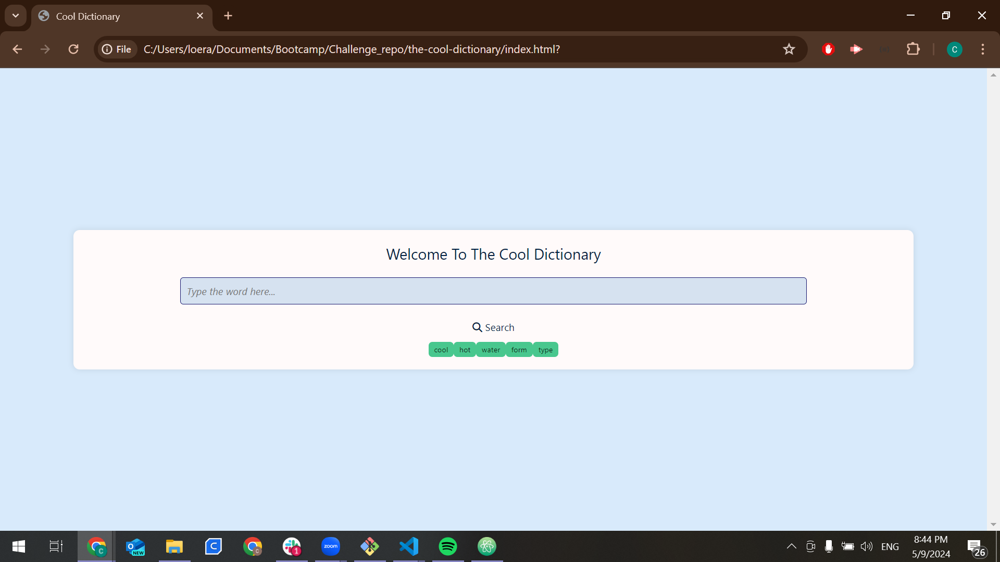
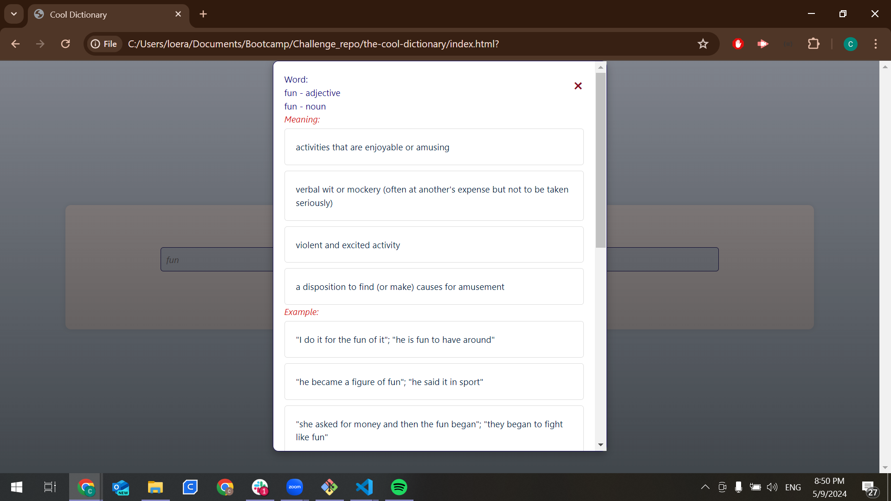

# The Cool Dictionary

## The story user

```

AS A USER, I want to know the meaning of a word, as it's synonym and antonym.

As a user when I start the application...
I will see a welcome page where I can enter "the word" of which I want to know its meaning, synonyms and antonyms.  
I will see an auto-fill input field with the last searched words (up to 12).
I will see a "SEARCH" button where I can CLICK once I have typed the word.
I will see the results getting the meaning, synonyms, antonyms, and the translation to Spanish.

The following image shows how the web application's appearance and functionality:
```






```
Contributors:
Alessandra Razo
Flavio Castorena
Miguel Perez
Cristian Loera

URL:
https://el-bicho7.github.io/the-cool-dictionary/

```
